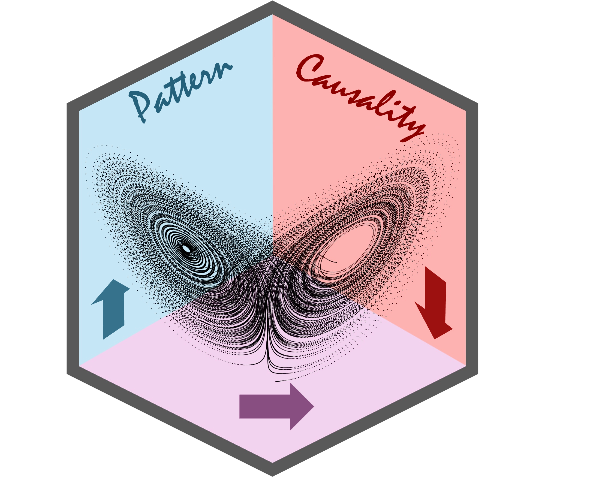

<!-- README.md is generated from README.Rmd. Please edit that file -->

# Pattern Causality 

<!-- badges: start -->

[](https://cran.r-project.org/package=patterncausality)
[](https://github.com/skstavroglou/pattern_causality/actions/workflows/R-CMD-check.yaml)
[](https://app.codecov.io/gh/skstavroglou/pattern_causality)
<!-- badges: end -->

## Overview

The goal of patterncausality is to measure the causality in the complex
system. The core of this algorithm is measure the strength of each
causality status like positive, negative, and dark in the view of
complex system, this method could be used for many different fields like
financial market, ecosystem, medical diagnosis and so on.

This algorithm has a lot of advantages.

- You can find the hidden pattern in the complex system.
- You can measure the causality in different fields.
- You can search for the best parameters for the complex system.

## Installation

You can install the development version of patterncausality from
[GitHub](https://github.com/skstavroglou/pattern_causality) with:

``` r
# install.packages("devtools")
devtools::install_github("skstavroglou/pattern_causality")
```

You can also install the package from
[CRAN](https://cran.r-project.org/web/packages/patterncausality/index.html)
with:

``` r
install.packages("patterncausality")
```

## Example

### Application in climate

We can import the existing data.

``` r
library(patterncausality)
data(climate)
head(climate)
#>         Date      AO    AAO   NAO   PNA
#> 1 1979-01-01 -2.2328 0.2088 -1.38 -0.69
#> 2 1979-02-01 -0.6967 0.3563 -0.67 -1.82
#> 3 1979-03-01 -0.8141 0.8992  0.78  0.38
#> 4 1979-04-01 -1.1568 0.6776 -1.71  0.09
#> 5 1979-05-01 -0.2501 0.7237 -1.03  1.35
#> 6 1979-06-01  0.9332 1.7000  1.60 -1.64
```

This dataset contains 4 time series of climate index, we could use the
patterncausality in this dataset.

Then we need to determine the `E` and `tao`.

``` r
dataset <- climate[, -1] # remove the date column
parameter <- optimalParametersSearch(Emax = 5, tauMax = 5, metric = "euclidean", dataset = dataset)
```

|     |       | Total     | of which Positive | of which Negative | of which Dark |
|-----|-------|-----------|-------------------|-------------------|---------------|
| E=2 | tau=1 | 0.5543614 | 0.5519477         | 0.4474361         | 0.0006162144  |
| E=2 | tau=2 | 0.5727414 | 0.5736100         | 0.4232828         | 0.0031071596  |
| E=2 | tau=3 | 0.5711838 | 0.5469069         | 0.4513270         | 0.0017660870  |
| E=3 | tau=1 | 0.3305296 | 0.3457169         | 0.2470929         | 0.4071902523  |
| E=3 | tau=2 | 0.3500000 | 0.4037138         | 0.2547524         | 0.3415338782  |
| E=3 | tau=3 | 0.3570093 | 0.3657638         | 0.2690536         | 0.3651826225  |

Of course, we can also change the distance style to calculate the
distance matrix. Then according the combo that produces the highest
percentages collectively, we can choose the best parameters here.

After the parameters are confirmed, we could calculate the pattern
causality.

``` r
X <- climate$AO
Y <- climate$AAO
pc <- pc_lightweight(X, Y, E = 3, tau = 2, metric = "euclidean", h = 1, weighted = TRUE)
#>   |                                                                              |                                                                      |   0%  |                                                                              |#                                                                     |   2%  |                                                                              |##                                                                    |   2%  |                                                                              |##                                                                    |   3%  |                                                                              |###                                                                   |   4%  |                                                                              |###                                                                   |   5%  |                                                                              |####                                                                  |   5%  |                                                                              |####                                                                  |   6%  |                                                                              |#####                                                                 |   7%  |                                                                              |#####                                                                 |   8%  |                                                                              |######                                                                |   8%  |                                                                              |######                                                                |   9%  |                                                                              |#######                                                               |   9%  |                                                                              |#######                                                               |  10%  |                                                                              |#######                                                               |  11%  |                                                                              |########                                                              |  11%  |                                                                              |########                                                              |  12%  |                                                                              |#########                                                             |  12%  |                                                                              |#########                                                             |  13%  |                                                                              |##########                                                            |  14%  |                                                                              |##########                                                            |  15%  |                                                                              |###########                                                           |  15%  |                                                                              |###########                                                           |  16%  |                                                                              |############                                                          |  17%  |                                                                              |############                                                          |  18%  |                                                                              |#############                                                         |  18%  |                                                                              |#############                                                         |  19%  |                                                                              |##############                                                        |  19%  |                                                                              |##############                                                        |  20%  |                                                                              |##############                                                        |  21%  |                                                                              |###############                                                       |  21%  |                                                                              |###############                                                       |  22%  |                                                                              |################                                                      |  22%  |                                                                              |################                                                      |  23%  |                                                                              |#################                                                     |  24%  |                                                                              |#################                                                     |  25%  |                                                                              |##################                                                    |  25%  |                                                                              |##################                                                    |  26%  |                                                                              |###################                                                   |  26%  |                                                                              |###################                                                   |  27%  |                                                                              |###################                                                   |  28%  |                                                                              |####################                                                  |  28%  |                                                                              |####################                                                  |  29%  |                                                                              |#####################                                                 |  29%  |                                                                              |#####################                                                 |  30%  |                                                                              |#####################                                                 |  31%  |                                                                              |######################                                                |  31%  |                                                                              |######################                                                |  32%  |                                                                              |#######################                                               |  32%  |                                                                              |#######################                                               |  33%  |                                                                              |########################                                              |  34%  |                                                                              |########################                                              |  35%  |                                                                              |#########################                                             |  35%  |                                                                              |#########################                                             |  36%  |                                                                              |##########################                                            |  36%  |                                                                              |##########################                                            |  37%  |                                                                              |##########################                                            |  38%  |                                                                              |###########################                                           |  38%  |                                                                              |###########################                                           |  39%  |                                                                              |############################                                          |  39%  |                                                                              |############################                                          |  40%  |                                                                              |############################                                          |  41%  |                                                                              |#############################                                         |  41%  |                                                                              |#############################                                         |  42%  |                                                                              |##############################                                        |  42%  |                                                                              |##############################                                        |  43%  |                                                                              |##############################                                        |  44%  |                                                                              |###############################                                       |  44%  |                                                                              |###############################                                       |  45%  |                                                                              |################################                                      |  45%  |                                                                              |################################                                      |  46%  |                                                                              |#################################                                     |  46%  |                                                                              |#################################                                     |  47%  |                                                                              |#################################                                     |  48%  |                                                                              |##################################                                    |  48%  |                                                                              |##################################                                    |  49%  |                                                                              |###################################                                   |  49%  |                                                                              |###################################                                   |  50%  |                                                                              |###################################                                   |  51%  |                                                                              |####################################                                  |  51%  |                                                                              |####################################                                  |  52%  |                                                                              |#####################################                                 |  52%  |                                                                              |#####################################                                 |  53%  |                                                                              |#####################################                                 |  54%  |                                                                              |######################################                                |  54%  |                                                                              |######################################                                |  55%  |                                                                              |#######################################                               |  55%  |                                                                              |#######################################                               |  56%  |                                                                              |########################################                              |  56%  |                                                                              |########################################                              |  57%  |                                                                              |########################################                              |  58%  |                                                                              |#########################################                             |  58%  |                                                                              |#########################################                             |  59%  |                                                                              |##########################################                            |  59%  |                                                                              |##########################################                            |  60%  |                                                                              |##########################################                            |  61%  |                                                                              |###########################################                           |  61%  |                                                                              |###########################################                           |  62%  |                                                                              |############################################                          |  62%  |                                                                              |############################################                          |  63%  |                                                                              |############################################                          |  64%  |                                                                              |#############################################                         |  64%  |                                                                              |#############################################                         |  65%  |                                                                              |##############################################                        |  65%  |                                                                              |##############################################                        |  66%  |                                                                              |###############################################                       |  67%  |                                                                              |###############################################                       |  68%  |                                                                              |################################################                      |  68%  |                                                                              |################################################                      |  69%  |                                                                              |#################################################                     |  69%  |                                                                              |#################################################                     |  70%  |                                                                              |#################################################                     |  71%  |                                                                              |##################################################                    |  71%  |                                                                              |##################################################                    |  72%  |                                                                              |###################################################                   |  72%  |                                                                              |###################################################                   |  73%  |                                                                              |###################################################                   |  74%  |                                                                              |####################################################                  |  74%  |                                                                              |####################################################                  |  75%  |                                                                              |#####################################################                 |  75%  |                                                                              |#####################################################                 |  76%  |                                                                              |######################################################                |  77%  |                                                                              |######################################################                |  78%  |                                                                              |#######################################################               |  78%  |                                                                              |#######################################################               |  79%  |                                                                              |########################################################              |  79%  |                                                                              |########################################################              |  80%  |                                                                              |########################################################              |  81%  |                                                                              |#########################################################             |  81%  |                                                                              |#########################################################             |  82%  |                                                                              |##########################################################            |  82%  |                                                                              |##########################################################            |  83%  |                                                                              |###########################################################           |  84%  |                                                                              |###########################################################           |  85%  |                                                                              |############################################################          |  85%  |                                                                              |############################################################          |  86%  |                                                                              |#############################################################         |  87%  |                                                                              |#############################################################         |  88%  |                                                                              |##############################################################        |  88%  |                                                                              |##############################################################        |  89%  |                                                                              |###############################################################       |  89%  |                                                                              |###############################################################       |  90%  |                                                                              |###############################################################       |  91%  |                                                                              |################################################################      |  91%  |                                                                              |################################################################      |  92%  |                                                                              |#################################################################     |  92%  |                                                                              |#################################################################     |  93%  |                                                                              |##################################################################    |  94%  |                                                                              |##################################################################    |  95%  |                                                                              |###################################################################   |  95%  |                                                                              |###################################################################   |  96%  |                                                                              |####################################################################  |  97%  |                                                                              |####################################################################  |  98%  |                                                                              |##################################################################### |  98%  |                                                                              |##################################################################### |  99%  |                                                                              |######################################################################|  99%  |                                                                              |######################################################################| 100%
print(pc)
#>       total positive  negative     dark
#> 1 0.2841121 0.326087 0.2318841 0.442029
```

Then the percentage of each status will be showed below.

If we wonder the status in each time point, we can run the code.

``` r
X <- climate$AO
Y <- climate$AAO
detail <- pc_fulldetails(X, Y, E = 2, tau = 1, metric = "euclidean", h = 3, weighted = TRUE)
#>   |                                                                              |                                                                      |   0%  |                                                                              |#                                                                     |   2%  |                                                                              |##                                                                    |   2%  |                                                                              |##                                                                    |   3%  |                                                                              |###                                                                   |   4%  |                                                                              |###                                                                   |   5%  |                                                                              |####                                                                  |   5%  |                                                                              |####                                                                  |   6%  |                                                                              |#####                                                                 |   6%  |                                                                              |#####                                                                 |   7%  |                                                                              |#####                                                                 |   8%  |                                                                              |######                                                                |   8%  |                                                                              |######                                                                |   9%  |                                                                              |#######                                                               |   9%  |                                                                              |#######                                                               |  10%  |                                                                              |#######                                                               |  11%  |                                                                              |########                                                              |  11%  |                                                                              |########                                                              |  12%  |                                                                              |#########                                                             |  12%  |                                                                              |#########                                                             |  13%  |                                                                              |#########                                                             |  14%  |                                                                              |##########                                                            |  14%  |                                                                              |##########                                                            |  15%  |                                                                              |###########                                                           |  15%  |                                                                              |###########                                                           |  16%  |                                                                              |############                                                          |  17%  |                                                                              |############                                                          |  18%  |                                                                              |#############                                                         |  18%  |                                                                              |#############                                                         |  19%  |                                                                              |##############                                                        |  19%  |                                                                              |##############                                                        |  20%  |                                                                              |##############                                                        |  21%  |                                                                              |###############                                                       |  21%  |                                                                              |###############                                                       |  22%  |                                                                              |################                                                      |  22%  |                                                                              |################                                                      |  23%  |                                                                              |#################                                                     |  24%  |                                                                              |#################                                                     |  25%  |                                                                              |##################                                                    |  25%  |                                                                              |##################                                                    |  26%  |                                                                              |###################                                                   |  27%  |                                                                              |###################                                                   |  28%  |                                                                              |####################                                                  |  28%  |                                                                              |####################                                                  |  29%  |                                                                              |#####################                                                 |  29%  |                                                                              |#####################                                                 |  30%  |                                                                              |#####################                                                 |  31%  |                                                                              |######################                                                |  31%  |                                                                              |######################                                                |  32%  |                                                                              |#######################                                               |  32%  |                                                                              |#######################                                               |  33%  |                                                                              |########################                                              |  34%  |                                                                              |########################                                              |  35%  |                                                                              |#########################                                             |  35%  |                                                                              |#########################                                             |  36%  |                                                                              |##########################                                            |  36%  |                                                                              |##########################                                            |  37%  |                                                                              |##########################                                            |  38%  |                                                                              |###########################                                           |  38%  |                                                                              |###########################                                           |  39%  |                                                                              |############################                                          |  39%  |                                                                              |############################                                          |  40%  |                                                                              |############################                                          |  41%  |                                                                              |#############################                                         |  41%  |                                                                              |#############################                                         |  42%  |                                                                              |##############################                                        |  42%  |                                                                              |##############################                                        |  43%  |                                                                              |##############################                                        |  44%  |                                                                              |###############################                                       |  44%  |                                                                              |###############################                                       |  45%  |                                                                              |################################                                      |  45%  |                                                                              |################################                                      |  46%  |                                                                              |#################################                                     |  47%  |                                                                              |#################################                                     |  48%  |                                                                              |##################################                                    |  48%  |                                                                              |##################################                                    |  49%  |                                                                              |###################################                                   |  49%  |                                                                              |###################################                                   |  50%  |                                                                              |###################################                                   |  51%  |                                                                              |####################################                                  |  51%  |                                                                              |####################################                                  |  52%  |                                                                              |#####################################                                 |  52%  |                                                                              |#####################################                                 |  53%  |                                                                              |######################################                                |  54%  |                                                                              |######################################                                |  55%  |                                                                              |#######################################                               |  55%  |                                                                              |#######################################                               |  56%  |                                                                              |########################################                              |  56%  |                                                                              |########################################                              |  57%  |                                                                              |########################################                              |  58%  |                                                                              |#########################################                             |  58%  |                                                                              |#########################################                             |  59%  |                                                                              |##########################################                            |  59%  |                                                                              |##########################################                            |  60%  |                                                                              |##########################################                            |  61%  |                                                                              |###########################################                           |  61%  |                                                                              |###########################################                           |  62%  |                                                                              |############################################                          |  62%  |                                                                              |############################################                          |  63%  |                                                                              |############################################                          |  64%  |                                                                              |#############################################                         |  64%  |                                                                              |#############################################                         |  65%  |                                                                              |##############################################                        |  65%  |                                                                              |##############################################                        |  66%  |                                                                              |###############################################                       |  67%  |                                                                              |###############################################                       |  68%  |                                                                              |################################################                      |  68%  |                                                                              |################################################                      |  69%  |                                                                              |#################################################                     |  69%  |                                                                              |#################################################                     |  70%  |                                                                              |#################################################                     |  71%  |                                                                              |##################################################                    |  71%  |                                                                              |##################################################                    |  72%  |                                                                              |###################################################                   |  72%  |                                                                              |###################################################                   |  73%  |                                                                              |####################################################                  |  74%  |                                                                              |####################################################                  |  75%  |                                                                              |#####################################################                 |  75%  |                                                                              |#####################################################                 |  76%  |                                                                              |######################################################                |  77%  |                                                                              |######################################################                |  78%  |                                                                              |#######################################################               |  78%  |                                                                              |#######################################################               |  79%  |                                                                              |########################################################              |  79%  |                                                                              |########################################################              |  80%  |                                                                              |########################################################              |  81%  |                                                                              |#########################################################             |  81%  |                                                                              |#########################################################             |  82%  |                                                                              |##########################################################            |  82%  |                                                                              |##########################################################            |  83%  |                                                                              |###########################################################           |  84%  |                                                                              |###########################################################           |  85%  |                                                                              |############################################################          |  85%  |                                                                              |############################################################          |  86%  |                                                                              |#############################################################         |  86%  |                                                                              |#############################################################         |  87%  |                                                                              |#############################################################         |  88%  |                                                                              |##############################################################        |  88%  |                                                                              |##############################################################        |  89%  |                                                                              |###############################################################       |  89%  |                                                                              |###############################################################       |  90%  |                                                                              |###############################################################       |  91%  |                                                                              |################################################################      |  91%  |                                                                              |################################################################      |  92%  |                                                                              |#################################################################     |  92%  |                                                                              |#################################################################     |  93%  |                                                                              |#################################################################     |  94%  |                                                                              |##################################################################    |  94%  |                                                                              |##################################################################    |  95%  |                                                                              |###################################################################   |  95%  |                                                                              |###################################################################   |  96%  |                                                                              |####################################################################  |  97%  |                                                                              |####################################################################  |  98%  |                                                                              |##################################################################### |  98%  |                                                                              |##################################################################### |  99%  |                                                                              |######################################################################|  99%  |                                                                              |######################################################################| 100%
predict_status <- detail$spectrumOfCausalityPredicted
real_status <- detail$spectrumOfCausalityReal
```

Then the status series will be saved in `predict_status` and
`real_status`.

### Conclusion

After calculating the causality, we can get the result here.

| Pairs         | total     | positive  | negative  | dark      | Dataset |
|---------------|-----------|-----------|-----------|-----------|---------|
| AAPL –\> MSFT | 0.2698665 | 0.3881279 | 0.1369863 | 0.4748858 | stock   |
| MSFT –\> AAPL | 0.2759887 | 0.4075893 | 0.1388393 | 0.4535714 | stock   |
| AO –\> AAO    | 0.2841121 | 0.326087  | 0.2318841 | 0.442029  | climate |
| AAO –\> AO    | 0.2803738 | 0.3602941 | 0.2647059 | 0.375     | climate |
| AO –\> P      | 0.3084112 | 0.1192053 | 0.4503311 | 0.4304636 | AUCO    |
| P –\> AO      | 0.3308411 | 0.3374233 | 0.2515337 | 0.4110429 | AUCO    |

## About the authors

**Stavros** is lecturer in credit risk and fin-tech at the University of
Edinburgh Business School and is the main creator for the algorithm of
the pattern causality.

<a href="mailto:stavros.k.stavroglou@gmail.com">

</a> <a href="https://github.com/skstavroglou">

</a> <a href="https://orcid.org/0000-0003-3931-0391">

</a> <a href="https://www.linkedin.com/in/stavroskstavroglou/">

</a>
<a href="https://scholar.google.co.uk/citations?user=jpSj6xgAAAAJ&hl=en">

</a>

**Athanasios** is professor in econometrics and business statistics of
Monash Business School and is the main author of the pattern causality.

<a href="mailto:Athanasios.Pantelous@monash.edu">

</a> <a href="https://orcid.org/0000-0001-5738-1471">

</a>
<a href="https://www.linkedin.com/in/athanasios-pantelous-6129513b/">

</a>
<a href="https://scholar.google.gr/citations?user=ZMaiiQwAAAAJ&hl=en">

</a>

**Hui** is MPhil student in econometrics and business statistics of
Monash Business School and is the author and maintainer of the
`patterncausality` package.

<a href="mailto:huiw1128@gmail.com">

</a> <a href="https://github.com/wanghui5801">

</a> <a href="https://orcid.org/0009-0006-0095-0243">

</a> <a href="https://www.linkedin.com/in/hui-wang-29b30029b/">

</a>
<a href="https://scholar.google.com/citations?view_op=list_works&hl=en&user=_FRaLycAAAAJ">

</a>

## References

- Stavroglou, S. K., Pantelous, A. A., Stanley, H. E., & Zuev, K. M.
  (2019). Hidden interactions in financial markets. *Proceedings of the
  National Academy of Sciences, 116(22)*, 10646-10651.

- Stavroglou, S. K., Pantelous, A. A., Stanley, H. E., & Zuev, K. M.
  (2020). Unveiling causal interactions in complex systems. *Proceedings
  of the National Academy of Sciences, 117(14)*, 7599-7605.

- Stavroglou, S. K., Ayyub, B. M., Kallinterakis, V., Pantelous, A. A.,
  & Stanley, H. E. (2021). A novel causal risk‐based decision‐making
  methodology: The case of coronavirus. *Risk Analysis, 41(5)*, 814-830.
