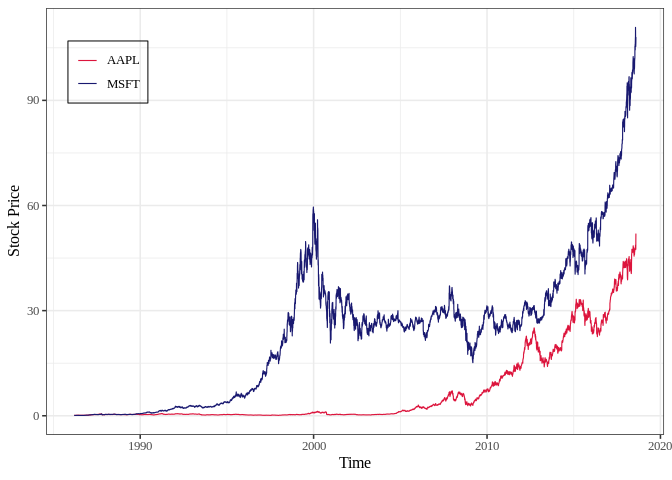
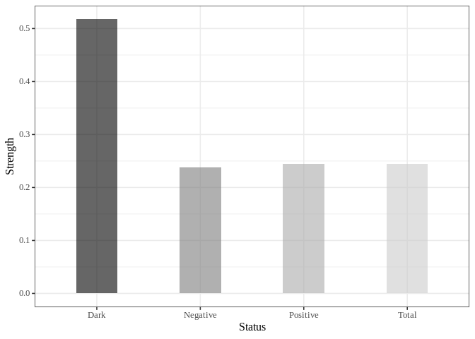

<!-- README.md is generated from README.Rmd. Please edit that file -->

# Pattern Causality

<!-- badges: start -->
<!-- badges: end -->

The goal of patterncausality is to measure the causality in the complex
system and financial market.

This algorithm has a lot of advantages than .

- You can find the hidden pattern in the complex system.
- You can measure the causality in different fields.
- You can search for the best parameters for the complex system.

## Installation

You can install the development version of patterncausality from
[GitHub](https://github.com/) with:

``` r
# install.packages("devtools")
devtools::install_github("skstavroglou/pattern-causality")
```

## Example

### Application in climate

We can import the existing data.

``` r
library(patterncausality)
#> Warning in fun(libname, pkgname): couldn't connect to display ":0"
```

``` r
data(climate)
```

This dataset contains 4 time series of climate index, we could use the
patterncausality in this dataset.

Then we need to determine the `E` and `tao`.

``` r
dataset <- climate[, -1] # remove the date column
parameter <- optimalParametersSearch(Emax = 3, tauMax = 3, metric = "euclidean", dataset = dataset)
```

|       |         | Total     | of which Positive | of which Negative | of which Dark |
|-------|---------|-----------|-------------------|-------------------|---------------|
| E = 2 | tau = 1 | 0.5543614 | 0.5519477         | 0.4474361         | 0.0006162144  |
| E = 2 | tau = 2 | 0.5727414 | 0.5736100         | 0.4232828         | 0.0031071596  |
| E = 2 | tau = 3 | 0.5711838 | 0.5469069         | 0.4513270         | 0.0017660870  |
| E = 3 | tau = 1 | 0.3305296 | 0.3457169         | 0.2470929         | 0.4071902523  |
| E = 3 | tau = 2 | 0.3500000 | 0.4037138         | 0.2547524         | 0.3415338782  |
| E = 3 | tau = 3 | 0.3570093 | 0.3657638         | 0.2690536         | 0.3651826225  |

Of course, we can also change the distance style to calculate the
distance matrix.

After the parameters are confirmed, we could calculate the pattern
causality.

``` r
X <- climate$AO
Y <- climate$AAO
pc <- PC.Mk.II.Lightweight(X, Y, E = 3, tau = 1, metric = "euclidean", h = 2, weighted = TRUE)
print(pc)
#>       total  positive  negative      dark
#> 1 0.3140187 0.2371795 0.3846154 0.3782051
```

Then the percentage of each status will be showed below.

If we wonder the status in each time point, we can run the code.

``` r
X <- climate$AO
Y <- climate$AAO
detail <- PC.Mk.II.Full.Details(X, Y, E = 2, tau = 1, metric = "euclidean", h = 3, weighted = TRUE)
predict_status <- detail$spectrumOfCausalityPredicted
real_stattus <- detail$spectrumOfCausalityReal
```

Then the status series will be saved in `predict_status` and
`real_status`.

### Application in financial market

First of all, we can import the data of AAPL and MSFT.

``` r
data(stock)
```

We can visualize this stock price.

    #> Warning: A numeric `legend.position` argument in `theme()` was deprecated in ggplot2
    #> 3.5.0.
    #> ℹ Please use the `legend.position.inside` argument of `theme()` instead.
    #> This warning is displayed once every 8 hours.
    #> Call `lifecycle::last_lifecycle_warnings()` to see where this warning was
    #> generated.



Then search the best parameters for the PC.

``` r
dataset <- stock
parameter <- optimalParametersSearch(Emax = 5, tauMax = 5, metric = "euclidean", dataset = dataset)
```

After that, calculate the causality of each status.

``` r
X <- stock$AAPL.Close
Y <- stock$MSFT.Close
pc <- PC.Mk.II.Lightweight(X, Y, E = 3, tau = 1, metric = "euclidean", h = 2, weighted = TRUE)
print(pc)
#>       total  positive  negative      dark
#> 1 0.2445206 0.2443325 0.2382872 0.5173804
```

Lastly we can also visualize this result.

``` r
library(ggplot2)
df = data.frame(
  name=stringr::str_to_title(c(colnames(pc))),
  val=as.vector(unlist(pc))
)

ggplot(df, aes(x=name, y=val, fill=name)) +
  geom_bar(stat="identity", alpha=.6, width=.4) +
  scale_fill_grey(start=0, end=0.8) +  # start and end define the range of grays
  labs(x='Status',y='Strength')+
  theme_bw(base_size = 12, base_family = "Times New Roman") +
  theme(legend.position="none", axis.text   = element_text(size = rel(0.8)), 
                strip.text  = element_text(size = rel(0.8)))
```



### Conclusion

After calculating the causality, we can get the result here.

| Pairs         | total     | positive  | negative  | dark      |
|---------------|-----------|-----------|-----------|-----------|
| AAPL –\> MSFT | 0.2445206 | 0.2443325 | 0.2382872 | 0.5173804 |
| MSFT –\> AAPL | 0.237174  | 0.2249351 | 0.2592208 | 0.5158442 |
| AO –\> AAO    | 0.3140187 | 0.2371795 | 0.3846154 | 0.3782051 |
| AAO –\> AO    | 0.2934579 | 0.3241379 | 0.1724138 | 0.5034483 |

## References

Based on the following **references**.

- Stavroglou, S. K., Pantelous, A. A., Stanley, H. E., & Zuev, K. M.
  (2019). Hidden interactions in financial markets. *Proceedings of the
  National Academy of Sciences, 116(22)*, 10646-10651.

- Stavroglou, S. K., Pantelous, A. A., Stanley, H. E., & Zuev, K. M.
  (2020). Unveiling causal interactions in complex systems. *Proceedings
  of the National Academy of Sciences, 117(14)*, 7599-7605.

- Stavroglou, S. K., Ayyub, B. M., Kallinterakis, V., Pantelous, A. A.,
  & Stanley, H. E. (2021). A novel causal risk‐based decision‐making
  methodology: The case of coronavirus. *Risk Analysis, 41(5)*, 814-830.

- Stavroglou, S. K., Pantelous, A. A., Ayyub, B. M., Lambert, J. H.,
  Hall, J. W., & Stanley, H. E. (2023). Prometheus Framework for Public
  Policy Decisions on Environmental Health Risks. *Available at SSRN
  4526256*.
