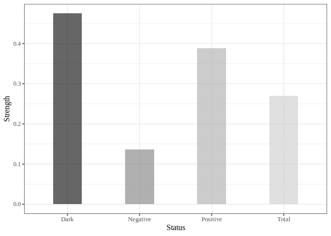

<!-- README.md is generated from README.Rmd. Please edit that file -->

# Pattern Causality

<!-- badges: start -->
<!-- badges: end -->

## Overview

The goal of patterncausality is to measure the causality in the complex
system. The core of this algorithm is measure the strength of each
causality status like positive, negative, and dark in the view of
complex system, this method could be used for many different fields like
financial market, ecosystem, medical diagnosis and so on.

This algorithm has a lot of advantages.

- You can find the hidden pattern in the complex system.
- You can measure the causality in different fields.
- You can search for the best parameters for the complex system.

## Installation

You can install the development version of patterncausality from
[GitHub](https://github.com/skstavroglou/pattern_causality) with:

``` r
# install.packages("devtools")
devtools::install_github("skstavroglou/pattern_causality")
```

You can also install the package from
[CRAN](https://cran.r-project.org/web/packages/patterncausality/index.html)
with:

``` r
install.packages("patterncausality")
```

## Example

### Application in climate

We can import the existing data.

``` r
library(patterncausality)
#> Warning in fun(libname, pkgname): couldn't connect to display ":0"
```

``` r
data(climate)
head(climate)
#>         Date      AO    AAO   NAO   PNA
#> 1 1979-01-01 -2.2328 0.2088 -1.38 -0.69
#> 2 1979-02-01 -0.6967 0.3563 -0.67 -1.82
#> 3 1979-03-01 -0.8141 0.8992  0.78  0.38
#> 4 1979-04-01 -1.1568 0.6776 -1.71  0.09
#> 5 1979-05-01 -0.2501 0.7237 -1.03  1.35
#> 6 1979-06-01  0.9332 1.7000  1.60 -1.64
```

This dataset contains 4 time series of climate index, we could use the
patterncausality in this dataset.

Then we need to determine the `E` and `tao`.

``` r
dataset <- climate[, -1] # remove the date column
parameter <- optimalParametersSearch(Emax = 5, tauMax = 5, metric = "euclidean", dataset = dataset)
```

|       |         | Total     | of which Positive | of which Negative | of which Dark |
|-------|---------|-----------|-------------------|-------------------|---------------|
| E = 2 | tau = 1 | 0.5543614 | 0.5519477         | 0.4474361         | 0.0006162144  |
| E = 2 | tau = 2 | 0.5727414 | 0.5736100         | 0.4232828         | 0.0031071596  |
| E = 2 | tau = 3 | 0.5711838 | 0.5469069         | 0.4513270         | 0.0017660870  |
| E = 3 | tau = 1 | 0.3305296 | 0.3457169         | 0.2470929         | 0.4071902523  |
| E = 3 | tau = 2 | 0.3500000 | 0.4037138         | 0.2547524         | 0.3415338782  |
| E = 3 | tau = 3 | 0.3570093 | 0.3657638         | 0.2690536         | 0.3651826225  |

Of course, we can also change the distance style to calculate the
distance matrix.

After the parameters are confirmed, we could calculate the pattern
causality.

``` r
X <- climate$AO
Y <- climate$AAO
pc <- PC.Mk.II.Lightweight(X, Y, E = 3, tau = 2, metric = "euclidean", h = 1, weighted = TRUE)
print(pc)
#>       total positive  negative     dark
#> 1 0.2841121 0.326087 0.2318841 0.442029
```

Then the percentage of each status will be showed below.

If we wonder the status in each time point, we can run the code.

``` r
X <- climate$AO
Y <- climate$AAO
detail <- PC.Mk.II.Full.Details(X, Y, E = 2, tau = 1, metric = "euclidean", h = 3, weighted = TRUE)
predict_status <- detail$spectrumOfCausalityPredicted
real_stattus <- detail$spectrumOfCausalityReal
```

Then the status series will be saved in `predict_status` and
`real_status`.

### Application in financial market

First of all, we can import the data of AAPL and MSFT.

``` r
data(stock)
head(stock)
#>            AAPL.Open AAPL.High AAPL.Low AAPL.Close AAPL.Volume AAPL.Adjusted
#> 1986-03-13  0.110491  0.111607 0.108817   0.110491   115964800    0.08527586
#> 1986-03-14  0.110491  0.117188 0.110491   0.116629   384854400    0.09001311
#> 1986-03-17  0.116071  0.116071 0.113281   0.116071   118720000    0.08958244
#> 1986-03-18  0.116071  0.121652 0.115513   0.119978   249356800    0.09259786
#> 1986-03-19  0.119978  0.121652 0.117746   0.118304   189884800    0.09130585
#> 1986-03-20  0.125000  0.132254 0.125000   0.126116   904131200    0.09733511
#>            MSFT.Open MSFT.High MSFT.Low MSFT.Close MSFT.Volume MSFT.Adjusted
#> 1986-03-13  0.088542  0.101563 0.088542   0.097222  1031788800    0.06005456
#> 1986-03-14  0.097222  0.102431 0.097222   0.100694   308160000    0.06219922
#> 1986-03-17  0.100694  0.103299 0.100694   0.102431   133171200    0.06327216
#> 1986-03-18  0.102431  0.103299 0.098958   0.099826    67766400    0.06166304
#> 1986-03-19  0.099826  0.100694 0.097222   0.098090    47894400    0.06059071
#> 1986-03-20  0.098090  0.098090 0.094618   0.095486    58435200    0.05898221
```

We can visualize this stock price.

    #> Warning: A numeric `legend.position` argument in `theme()` was deprecated in ggplot2
    #> 3.5.0.
    #> ℹ Please use the `legend.position.inside` argument of `theme()` instead.
    #> This warning is displayed once every 8 hours.
    #> Call `lifecycle::last_lifecycle_warnings()` to see where this warning was
    #> generated.


Then search the best parameters for the PC.

``` r
dataset <- stock
parameter <- optimalParametersSearch(Emax = 5, tauMax = 5, metric = "euclidean", dataset = dataset)
```

After that, calculate the causality of each status.

``` r
X <- stock$AAPL.Close
Y <- stock$MSFT.Close
pc <- PC.Mk.II.Lightweight(X, Y, E = 3, tau = 2, metric = "euclidean", h = 1, weighted = TRUE)
print(pc)
#>       total  positive  negative      dark
#> 1 0.2698665 0.3881279 0.1369863 0.4748858
```

Lastly we can also visualize this result.

``` r
library(ggplot2)
df = data.frame(
  name=stringr::str_to_title(c(colnames(pc))),
  val=as.vector(unlist(pc))
)

ggplot(df, aes(x=name, y=val, fill=name)) +
  geom_bar(stat="identity", alpha=.6, width=.4) +
  scale_fill_grey(start=0, end=0.8) +  # start and end define the range of grays
  labs(x='Status',y='Strength')+
  theme_bw(base_size = 12, base_family = "Times New Roman") +
  theme(legend.position="none", axis.text   = element_text(size = rel(0.8)), 
                strip.text  = element_text(size = rel(0.8)))
```



### Conclusion

After calculating the causality, we can get the result here.

| Pairs         | total     | positive  | negative  | dark      | Dataset |
|---------------|-----------|-----------|-----------|-----------|---------|
| AAPL –\> MSFT | 0.2698665 | 0.3881279 | 0.1369863 | 0.4748858 | stock   |
| MSFT –\> AAPL | 0.2759887 | 0.4075893 | 0.1388393 | 0.4535714 | stock   |
| AO –\> AAO    | 0.2841121 | 0.326087  | 0.2318841 | 0.442029  | climate |
| AAO –\> AO    | 0.2803738 | 0.3602941 | 0.2647059 | 0.375     | climate |
| AO –\> P      | 0.3084112 | 0.1192053 | 0.4503311 | 0.4304636 | AUCO    |
| P –\> AO      | 0.3308411 | 0.3374233 | 0.2515337 | 0.4110429 | AUCO    |

## References

- Stavroglou, S. K., Pantelous, A. A., Stanley, H. E., & Zuev, K. M.
  (2019). Hidden interactions in financial markets. *Proceedings of the
  National Academy of Sciences, 116(22)*, 10646-10651.

- Stavroglou, S. K., Pantelous, A. A., Stanley, H. E., & Zuev, K. M.
  (2020). Unveiling causal interactions in complex systems. *Proceedings
  of the National Academy of Sciences, 117(14)*, 7599-7605.

- Stavroglou, S. K., Ayyub, B. M., Kallinterakis, V., Pantelous, A. A.,
  & Stanley, H. E. (2021). A novel causal risk‐based decision‐making
  methodology: The case of coronavirus. *Risk Analysis, 41(5)*, 814-830.
